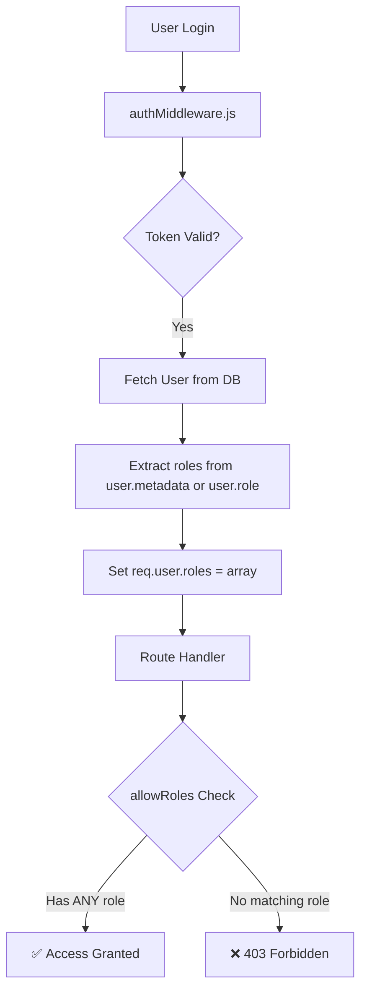

# Multi-Role System Documentation

> **Last Updated**: December 14, 2025  
> **Version**: 2.0 (Multi-Role Architecture)

---

## Table of Contents

1. [Overview](#overview)
2. [Multi-Role Architecture](#multi-role-architecture)
3. [How It Works](#how-it-works)
4. [Role Priority System](#role-priority-system)
5. [Database Schema](#database-schema)
6. [API Usage](#api-usage)
7. [Frontend Integration](#frontend-integration)
8. [Examples](#examples)

---

## Overview

The Sai Samsthan Temple Management System supports **multiple roles per user account**. This allows a single user to have different responsibilities across the system without needing separate accounts.

### Key Benefits

| Benefit | Description |
|---------|-------------|
| **Single Sign-On** | One login, multiple capabilities |
| **Flexible Access** | User can act as Priest, Finance, and Board Member all at once |
| **Granular Permissions** | Route-level access checks using `req.user.roles` array |
| **Backward Compatible** | Legacy `role` field still works for single-role scenarios |

---

## Multi-Role Architecture

### Data Storage Layers

The system uses three layers for role management:

```
┌─────────────────────────────────────────────────────────────┐
│                    users.role (Primary)                      │
│                    Single string, e.g., "admin"              │
├─────────────────────────────────────────────────────────────┤
│                   users.metadata.roles[]                     │
│                   Array of all roles assigned                │
├─────────────────────────────────────────────────────────────┤
│                     user_roles table                         │
│                   Additional role assignments with           │
│                   expiry, community context, audit trail     │
└─────────────────────────────────────────────────────────────┘
```

### Component Flow



---

## How It Works

### 1. User Creation with Multiple Roles

When creating a user via the Admin Panel:

```javascript
// POST /api/admin/create-user (single role - backward compatible)
{
  "email": "user@example.com",
  "full_name": "John Doe",
  "role": "priest"  // Single role
}

// POST /api/users/register (with roles array)
{
  "email": "user@example.com",
  "full_name": "Multi-Role User",
  "roles": ["priest", "finance_team"]  // Multiple roles
}
```

### 2. Role Storage in HybridUserService

From [hybridUserService.js](file:///home/aaron/codeaaron/Prod/saisamsthan/saisamsthan-backend/src/services/hybridUserService.js):

```javascript
// Handle both 'role' (string) and 'roles' (array) inputs
let roles = userData.roles;
if (!roles || !Array.isArray(roles) || roles.length === 0) {
  roles = userData.role ? [userData.role] : ['user'];
}
const primaryRole = this.getPrimaryRole(roles);

const user = {
  role: primaryRole,              // Primary role (backward compat)
  roles: roles,                   // Full list of roles  
  metadata: { roles: roles },     // Stored in JSONB for Supabase
};
```

### 3. Authentication & Role Extraction

From [authMiddleware.js](file:///home/aaron/codeaaron/Prod/saisamsthan/saisamsthan-backend/src/middleware/authMiddleware.js):

```javascript
// Extract roles from user data
const roles = user.roles || (user.role ? [user.role] : ['user']);

req.user = {
  id: user.id,
  email: user.email,
  role: user.role,     // Primary role (string)
  roles: roles         // All roles (array) - USED FOR ACCESS CHECKS
};
```

### 4. Route Protection with Multi-Role Check

From [authMiddleware.js](file:///home/aaron/codeaaron/Prod/saisamsthan/saisamsthan-backend/src/middleware/authMiddleware.js):

```javascript
const requireRole = (allowedRoles) => {
  return async (req, res, next) => {
    // Check if user has ANY of the required roles (multi-role support)
    const hasAccess = req.user.roles.some(r => allowedRoles.includes(r));
    if (!hasAccess) {
      return res.status(403).json({
        success: false,
        message: `Access denied. Required role: ${allowedRoles.join(' or ')}`
      });
    }
    next();
  };
};
```

---

## Role Priority System

When a user has multiple roles, the system determines a **primary role** based on privilege hierarchy.

### Priority Order (Highest to Lowest)

From [hybridUserService.js](file:///home/aaron/codeaaron/Prod/saisamsthan/saisamsthan-backend/src/services/hybridUserService.js):

| Priority | Role | Description |
|----------|------|-------------|
| 1 | `admin` | Full system access |
| 2 | `board` | Board member privileges |
| 3 | `chair_board` | Chair of the Board |
| 4 | `chairman` | Chairman of the Board |
| 5 | `community_owner` | Community ownership |
| 6 | `volunteer_head` | Volunteer management lead |
| 7 | `finance_team` | Financial access |
| 8 | `priest` | Priest dashboard access |
| 9 | `community_lead` | Community lead role |
| 10 | `community_member` | Community membership |
| 11 | `volunteer` | Basic volunteer |
| 12 | `user` | Default/lowest |

### Usage Example

```javascript
// User has roles: ['priest', 'finance_team', 'volunteer']
const primaryRole = HybridUserService.getPrimaryRole(roles);
// Returns: 'finance_team' (higher priority than priest)
```

> [!NOTE]
> The primary role is used for backward compatibility with code that checks `user.role` instead of `user.roles`.

---

## Database Schema

### users Table

```sql
CREATE TABLE public.users (
  id uuid NOT NULL,
  email text NOT NULL UNIQUE,
  full_name text NOT NULL,
  role text DEFAULT 'user',           -- Primary role (string)
  metadata jsonb DEFAULT '{}',        -- Contains roles array
  -- ... other fields
);
```

The `metadata` column stores additional roles:
```json
{
  "roles": ["priest", "finance_team", "volunteer"]
}
```

### user_roles Table

For more granular role management with audit trail:

```sql
CREATE TABLE public.user_roles (
  id uuid PRIMARY KEY DEFAULT uuid_generate_v4(),
  user_id uuid NOT NULL REFERENCES users(id),
  role text NOT NULL,
  community_id uuid,                  -- For community-scoped roles
  granted_by uuid REFERENCES users(id),
  granted_at timestamptz DEFAULT now(),
  expires_at timestamptz,             -- Optional expiry
  is_active boolean DEFAULT true
);
```

> [!IMPORTANT]
> The `users.role` field is the **primary source of truth** for single-role checks. The `user_roles` table is used for additional roles and audit purposes.

---

## API Usage

### Creating a Multi-Role User (Admin Only)

```bash
POST /api/users/register
Authorization: Bearer <admin_token>

{
  "email": "multiuser@temple.org",
  "full_name": "Multi-Role User",
  "phone": "+1234567890",
  "roles": ["priest", "finance_team"]
}
```

**Response:**
```json
{
  "success": true,
  "message": "User registered successfully",
  "data": {
    "user": {
      "id": "uuid",
      "email": "multiuser@temple.org",
      "role": "finance_team",
      "status": "active"
    }
  }
}
```

### Assigning Additional Role

```bash
POST /api/admin/assign-role
Authorization: Bearer <admin_token>

{
  "email": "existing@temple.org",
  "role": "volunteer_head"
}
```

**Response:**
```json
{
  "success": true,
  "message": "Role 'volunteer_head' assigned successfully to existing@temple.org",
  "data": {
    "user_id": "uuid",
    "email": "existing@temple.org",
    "previous_role": "volunteer",
    "new_role": "volunteer_head"
  }
}
```

### Getting User with Roles

```bash
GET /api/users/me
Authorization: Bearer <token>
```

**Response:**
```json
{
  "success": true,
  "data": {
    "id": "uuid",
    "email": "multiuser@temple.org",
    "full_name": "Multi-Role User",
    "role": "finance_team",
    "roles": ["priest", "finance_team", "volunteer"]
  }
}
```

---

## Frontend Integration

### Checking User Roles

```typescript
// Get user from auth context
const { user } = useAuth();

// Check if user has a specific role
const hasRole = (role: string) => user?.roles?.includes(role);

// Check if user has ANY of the required roles
const hasAnyRole = (allowedRoles: string[]) => 
  user?.roles?.some(r => allowedRoles.includes(r));

// Usage
if (hasAnyRole(['admin', 'finance_team'])) {
  // Show finance dashboard
}
```

### Role-Based Navigation (App.tsx pattern)

```tsx
<Route
  path="/finance"
  element={
    <ProtectedRoute allowedRoles={['admin', 'board', 'chair_board', 'chairman', 'finance_team']}>
      <FinanceDashboard />
    </ProtectedRoute>
  }
/>
```

### Sidebar Visibility

```tsx
const menuItems = [
  { name: 'Dashboard', path: '/', roles: ['*'] },
  { name: 'Finance', path: '/finance', roles: ['admin', 'board', 'finance_team'] },
  { name: 'Priests', path: '/priests', roles: ['admin', 'board', 'priest'] },
  { name: 'Website', path: '/website', roles: ['admin', 'board', 'priest'] },
];

// Filter based on user roles
const visibleItems = menuItems.filter(item => 
  item.roles.includes('*') || user?.roles?.some(r => item.roles.includes(r))
);
```

---

## Examples

### Example 1: Priest with Finance Access

A temple priest who also handles donation receipts:

```json
{
  "email": "priest.finance@temple.org",
  "full_name": "Pandit Finance",
  "roles": ["priest", "finance_team"]
}
```

**Access Capabilities:**
- ✅ Priest Dashboard (`/priests`)
- ✅ Priest Bookings (`/priest-bookings`)
- ✅ Finance Dashboard (`/finance`)
- ✅ Donations Management (`/donations`)
- ✅ Expense Reports (`/expenses`)
- ✅ Website Tab (`/website`)

### Example 2: Board Member + Volunteer Coordinator

A board member who also coordinates volunteer activities:

```json
{
  "email": "board.volhead@temple.org",
  "full_name": "Board Volunteer Lead",
  "roles": ["board", "volunteer_head"]
}
```

**Access Capabilities:**
- ✅ All Board features
- ✅ Reports (`/reports`)
- ✅ Volunteer Management (`/volunteers`)
- ✅ Shift Management
- ✅ Volunteer Applications approval

### Example 3: Super Admin

For testing all functionality:

```json
{
  "email": "saibabausa.dev+all@gmail.com",
  "full_name": "Super User",
  "roles": ["admin", "board", "priest", "finance_team", "volunteer_head"]
}
```

---

## Middleware Reference

### Available Middleware Functions

| Middleware | File | Purpose |
|------------|------|---------|
| `requireAuth` | authMiddleware.js | Blocks requests without valid JWT |
| `requireRole(roles[])` | authMiddleware.js | Checks if user has ANY of specified roles |
| `allowRoles(roles[])` | rbacMiddleware.js | Same as requireRole, with admin bypass |
| `checkRole(roles[])` | roleAuth.js | Legacy role check, admin bypass |

### Admin Bypass

All role-checking middleware includes automatic bypass for `admin` role:

```javascript
// From rbacMiddleware.js
if (req.user.roles.includes(ROLES.ADMIN)) return next();
```

---

## Recent Changes (December 2025)

### December 14, 2025

- Added comprehensive multi-role documentation
- Updated RBAC.md with current route permissions
- Added ROLE_SYSTEM.md with mobile app integration guide
- Created TEST_CREDENTIALS.md with multi-role test examples

### December 13, 2025

1. **Fixed variable scope bugs** in volunteer/community approval flows
2. **Updated assign-role endpoint** to query `users` table directly
3. **Added role priority system** in HybridUserService
4. **Extended PERMISSIONS** constants with chair_board and chairman roles

---

## Best Practices

1. **Always check `req.user.roles`** (array), not `req.user.role` (string)
2. **Use `requireRole()` middleware** for protected routes
3. **Admin bypasses all checks** - be careful with admin accounts
4. **Store roles in metadata** for Supabase compatibility
5. **Primary role = highest priority** for backward compatibility
6. **Audit role changes** using the `user_roles` table with `granted_by` tracking

---

## Support

For questions about the multi-role system, refer to:

- [RBAC.md](./RBAC.md) - Endpoint access matrix
- [ROLE_SYSTEM.md](./ROLE_SYSTEM.md) - Mobile app integration
- [TEST_CREDENTIALS.md](./TEST_CREDENTIALS.md) - Test account setup
