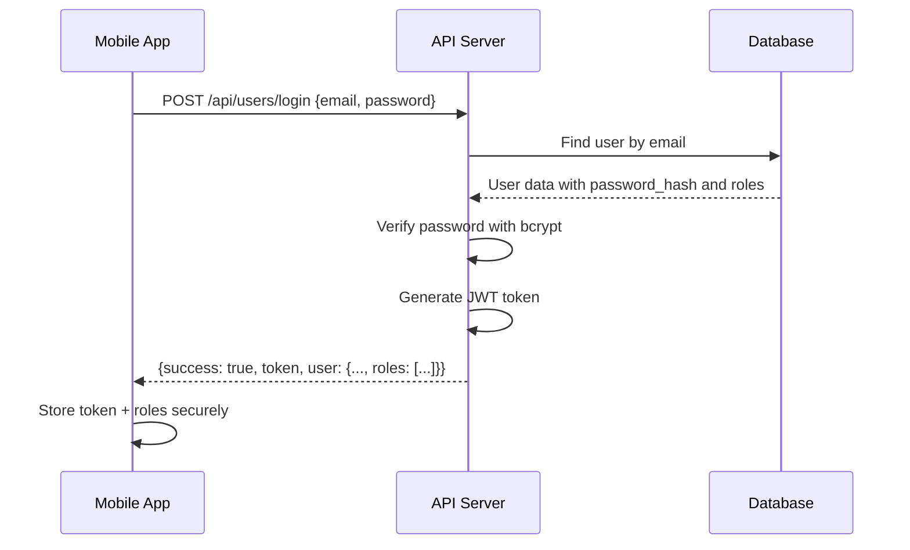

# Role System Documentation

> **Last Updated**: December 14, 2025  
> **For**: Mobile App Development Reference

---

## Table of Contents

1. [Overview](#overview)
2. [Role Types](#role-types)
3. [Multi-Role Support](#multi-role-support)
4. [User Creation Flows](#user-creation-flows)
5. [API Endpoints](#api-endpoints)
6. [Database Schema](#database-schema)
7. [Role Permissions](#role-permissions)
8. [Authentication Flow](#authentication-flow)
9. [Mobile App Integration](#mobile-app-integration)

---

## Overview

The Sai Samsthan Temple Management System uses a role-based access control (RBAC) system with **multi-role support**. Users can have multiple roles simultaneously.

### Key Concepts

| Concept | Description |
|---------|-------------|
| **User** | A person with login credentials stored in the `users` table |
| **Primary Role** | Stored in `users.role` (single string for backward compatibility) |
| **Roles Array** | Full list of roles in `users.metadata.roles` and `req.user.roles` |
| **Community Member** | A user who belongs to a specific community |
| **Volunteer** | A user who volunteers (linked via `volunteers` table) |

---

## Role Types

### System Roles Hierarchy

```
admin (highest)
├── board / chair_board / chairman
│   ├── community_owner
│   │   ├── volunteer_head
│   │   └── priest
│   └── finance_team
├── community_lead
├── community_member
├── volunteer
└── user (lowest)
```

### Role Descriptions

| Role | Description | Access Level |
|------|-------------|--------------| 
| `admin` | Full system access, can create users and assign roles | Full |
| `board` | Board member, can view reports and manage most features | High |
| `chair_board` | Chair of the Board | High |
| `chairman` | Chairman of the Board | High |
| `community_owner` | Owns a community, can manage community settings | Medium-High |
| `volunteer_head` | Manages volunteers, can approve volunteer applications | Medium |
| `priest` | Priest role, can manage priest bookings and availability | Medium |
| `finance_team` | Can access financial reports and donations | Medium |
| `community_lead` | Leads activities within a community | Medium |
| `community_member` | Basic member of a community | Low |
| `volunteer` | Volunteer with shift management access | Low |
| `user` | Basic user with minimal access | Lowest |

---

## Multi-Role Support

### How It Works

A single user account can have multiple roles:

```javascript
// User data structure
{
  "id": "uuid",
  "email": "user@temple.org",
  "role": "finance_team",           // Primary role (highest priority)
  "roles": ["priest", "finance_team", "volunteer"]  // All roles
}
```

### Role Priority

When assigning a primary role, the system uses priority order:

1. `admin`
2. `board`
3. `chair_board`
4. `chairman`
5. `community_owner`
6. `volunteer_head`
7. `finance_team`
8. `priest`
9. `community_lead`
10. `community_member`
11. `volunteer`
12. `user`

### Access Checking

Route access is granted if user has **ANY** of the required roles:

```javascript
// Middleware check
const hasAccess = req.user.roles.some(r => allowedRoles.includes(r));
```

---

## User Creation Flows

### Flow 1: Admin Creates User Directly

**Endpoint**: `POST /api/admin/create-user`

**When**: Admin creates privileged users (admin, board, priest, etc.)

**Process**:
1. Admin provides: `email`, `full_name`, `phone`, `role`
2. System generates random 12-character password
3. User record created in `users` table with specified role
4. Welcome email sent with login credentials

**Request Body**:
```json
{
  "email": "user@example.com",
  "full_name": "John Doe",
  "phone": "+1234567890",
  "role": "board"
}
```

**Response**:
```json
{
  "success": true,
  "message": "User created successfully",
  "data": {
    "user": {
      "id": "uuid",
      "email": "user@example.com",
      "full_name": "John Doe",
      "role": "board",
      "status": "active"
    },
    "temporaryPassword": "Abc123!@#xyz",
    "emailSent": true
  }
}
```

---

### Flow 2: Multi-Role User Registration

**Endpoint**: `POST /api/users/register`

**When**: Creating a user with multiple roles

**Request Body**:
```json
{
  "email": "multiuser@temple.org",
  "full_name": "Multi-Role User",
  "phone": "+1234567890",
  "roles": ["priest", "finance_team"]
}
```

**Response**:
```json
{
  "success": true,
  "data": {
    "user": {
      "id": "uuid",
      "email": "multiuser@temple.org",
      "role": "finance_team",
      "status": "active"
    },
    "token": "jwt..."
  }
}
```

---

### Flow 3: Community Member Application

**Endpoints**: 
- Submit: `POST /api/public/community/apply`
- Approve: `PUT /api/communities/applications/:id/approve`

**When**: Public user applies to join a community

**Process**:
1. User submits application (name, email, phone, interests)
2. Application stored in `community_applications` table with status `pending`
3. Admin/Community Owner reviews and approves
4. **On Approval**:
   - Check if user exists in `users` table
   - If NOT exists → Create new user with role `community_member` and random password
   - If EXISTS → Skip user creation
   - Add user to `community_members` table (links user to specific community)
   - Send approval email with credentials (if new user)

---

### Flow 4: Volunteer Application

**Endpoints**:
- Submit: `POST /api/public/volunteers/apply`
- Approve: `PUT /api/volunteers/applications/:id/approve`

**When**: Public user applies to become a volunteer

**Process**:
1. User submits volunteer application
2. Application stored in `volunteer_applications` table with status `pending`
3. Admin/Volunteer Head reviews and approves
4. **On Approval**:
   - Create volunteer record in `volunteers` table
   - Check if user exists in `users` table
   - If NOT exists → Create new user with role `volunteer` and random password
   - If EXISTS → Skip user creation (but don't overwrite role)
   - Link volunteer record to user via `user_id`
   - Send approval email with credentials

---

## API Endpoints

### Authentication

| Method | Endpoint | Description | Auth Required |
|--------|----------|-------------|---------------|
| POST | `/api/users/login` | Login with email/password | No |
| GET | `/api/users/me` | Get current user profile | Yes |
| POST | `/api/users/change-password` | Change password | Yes |

### Admin User Management

| Method | Endpoint | Description | Roles |
|--------|----------|-------------|-------|
| POST | `/api/admin/create-user` | Create new user with role | `admin` |
| POST | `/api/admin/assign-role` | Assign role to existing user | `admin` |
| GET | `/api/admin/users` | Get all users | `admin` |
| POST | `/api/admin/resend-credentials` | Resend login credentials | `admin` |

### Volunteer Management

| Method | Endpoint | Description | Roles |
|--------|----------|-------------|-------|
| GET | `/api/volunteers` | Get all volunteers | Any authenticated |
| POST | `/api/volunteers` | Create new volunteer | Any authenticated |
| GET | `/api/volunteers/applications` | Get volunteer applications | Any authenticated |
| PUT | `/api/volunteers/applications/:id/approve` | Approve application | Any authenticated |
| PUT | `/api/volunteers/applications/:id/reject` | Reject application | Any authenticated |

---

## Database Schema

### users Table

```sql
CREATE TABLE public.users (
  id uuid PRIMARY KEY,
  email text UNIQUE NOT NULL,
  password_hash text NOT NULL,
  full_name text,
  phone text,
  role text DEFAULT 'user',           -- Primary role (single string)
  metadata jsonb DEFAULT '{}',        -- Contains roles array
  status text DEFAULT 'active',
  last_login_at timestamptz,
  created_at timestamptz DEFAULT NOW(),
  updated_at timestamptz DEFAULT NOW()
);
```

**Metadata structure**:
```json
{
  "roles": ["priest", "finance_team", "volunteer"]
}
```

### user_roles Table

```sql
CREATE TABLE public.user_roles (
  id uuid PRIMARY KEY,
  user_id uuid NOT NULL REFERENCES users(id),
  role text NOT NULL,
  community_id uuid,                  -- For community-scoped roles
  granted_by uuid REFERENCES users(id),
  granted_at timestamptz DEFAULT NOW(),
  expires_at timestamptz,             -- Optional role expiry
  is_active boolean DEFAULT true
);
```

### volunteers Table

```sql
CREATE TABLE public.volunteers (
  id uuid PRIMARY KEY,
  user_id uuid REFERENCES users(id),  -- Links to users table
  community_id uuid REFERENCES communities(id),
  first_name varchar NOT NULL,
  last_name varchar,
  email varchar NOT NULL,
  phone varchar,
  skills jsonb DEFAULT '[]',
  interests jsonb DEFAULT '[]',
  status varchar DEFAULT 'active',
  total_hours_volunteered integer DEFAULT 0,
  created_at timestamptz DEFAULT NOW()
);
```

### community_members Table

```sql
CREATE TABLE public.community_members (
  id uuid PRIMARY KEY,
  community_id uuid NOT NULL REFERENCES communities(id),
  user_id uuid NOT NULL REFERENCES users(id),
  role varchar DEFAULT 'member',      -- Community-specific role
  status varchar DEFAULT 'active',
  is_lead boolean DEFAULT FALSE,
  joined_at timestamptz DEFAULT NOW(),
  UNIQUE(community_id, user_id)
);
```

---

## Role Permissions

### Feature Access Matrix

| Feature | admin | board | chair_board | chairman | finance_team | priest | volunteer_head | volunteer |
|---------|-------|-------|-------------|----------|--------------|--------|----------------|-----------|
| User Management | ✅ | ❌ | ❌ | ❌ | ❌ | ❌ | ❌ | ❌ |
| Assign Roles | ✅ | ❌ | ❌ | ❌ | ❌ | ❌ | ❌ | ❌ |
| Reports | ✅ | ✅ | ✅ | ✅ | ❌ | ❌ | ❌ | ❌ |
| Finance | ✅ | ✅ | ✅ | ✅ | ✅ | ❌ | ❌ | ❌ |
| Website CMS | ✅ | ✅ | ✅ | ✅ | ❌ | ✅ | ❌ | ❌ |
| Volunteer Apps | ✅ | ✅ | ✅ | ✅ | ❌ | ❌ | ✅ | ❌ |
| Volunteer Shifts | ✅ | ✅ | ✅ | ✅ | ❌ | ❌ | ✅ | ✅ |
| Priest Bookings | ✅ | ✅ | ✅ | ✅ | ❌ | ✅ | ❌ | ❌ |
| Events | ✅ | ✅ | ✅ | ✅ | ❌ | ✅ | ✅ | ✅ |
| Profile | ✅ | ✅ | ✅ | ✅ | ✅ | ✅ | ✅ | ✅ |

---

## Authentication Flow

### Login Flow



### Token Structure

```json
{
  "id": "uuid",
  "email": "user@example.com",
  "role": "volunteer",
  "iat": 1702468800,
  "exp": 1702555200
}
```

### Authenticated Requests

Include the JWT token in the `Authorization` header:

```
Authorization: Bearer <jwt_token>
```

---

## Mobile App Integration

### Checking User Roles

After login, the response includes the user's roles:

```javascript
// Login response
{
  "success": true,
  "token": "eyJhbGciOiJIUzI1...",
  "data": {
    "user": {
      "id": "uuid",
      "email": "user@example.com",
      "full_name": "John Doe",
      "role": "finance_team",           // Primary role
      "roles": ["priest", "finance_team"] // All roles
    }
  }
}

// Check roles for UI decisions
const userRoles = response.data.user.roles || [response.data.user.role];

const hasFinanceAccess = userRoles.some(r => 
  ['admin', 'board', 'finance_team'].includes(r)
);
```

### Role-Based Navigation

```javascript
const getNavigationTabs = (roles) => {
  const tabs = ['Home', 'Profile'];
  
  if (roles.some(r => ['admin', 'board', 'volunteer_head', 'volunteer'].includes(r))) {
    tabs.push('Shifts');
  }
  
  if (roles.some(r => ['admin', 'board', 'community_owner', 'community_member'].includes(r))) {
    tabs.push('Community');
  }
  
  if (roles.some(r => ['admin', 'board', 'finance_team'].includes(r))) {
    tabs.push('Finance');
  }
  
  if (roles.some(r => ['admin', 'board', 'priest'].includes(r))) {
    tabs.push('Priest');
  }
  
  return tabs;
};
```

### Handling Permission Denied

```javascript
// API Error Response
{
  "success": false,
  "message": "Access denied. Required role: admin or board"
}

// Handle in mobile app
if (response.status === 403) {
  showAlert("You don't have permission to access this feature");
  navigateTo('Home');
}
```

---

## Best Practices for Mobile Development

1. **Store roles locally** - Cache `user.roles` array on login for quick access
2. **Check roles before showing features** - Don't rely on hiding UI alone
3. **Use `roles.some()` for checking** - Enables multi-role support
4. **Handle token expiry gracefully** - Redirect to login on 401
5. **Never hardcode role checks** - Use a centralized permission function
6. **Refresh user data on app foreground** - Roles might have changed

---

## Support

For questions about the role system, refer to:

- [MULTI_ROLE_SYSTEM.md](./MULTI_ROLE_SYSTEM.md) - Detailed multi-role architecture
- [RBAC.md](./RBAC.md) - Endpoint access matrix
- [TEST_CREDENTIALS.md](./TEST_CREDENTIALS.md) - Test account setup
- [API_ENDPOINTS.md](./API_ENDPOINTS.md) - Complete API reference
